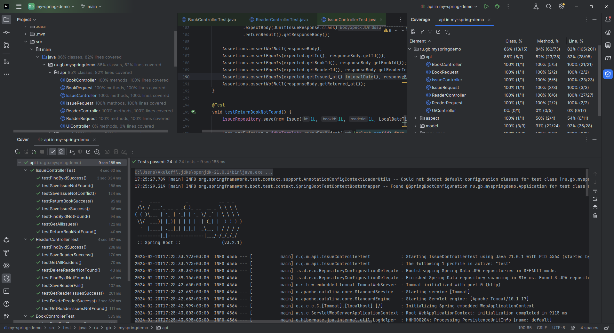
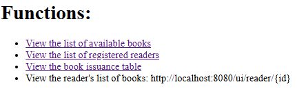
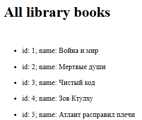
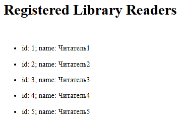
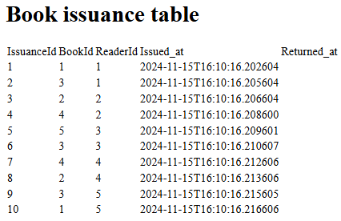
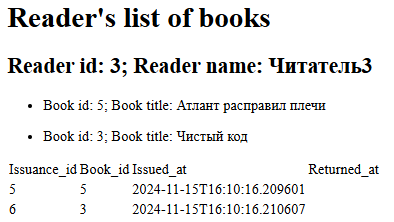
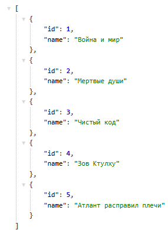
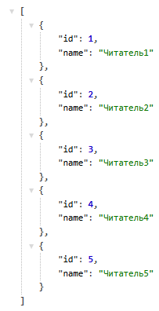
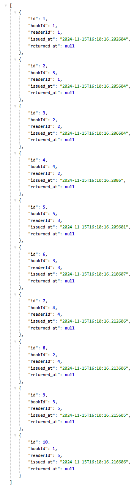

## Веб-приложение для книжной библиотеки на основе монолитной архитектуры и Spring Framework

---

### Функционал: 

1. Сервис [Книг](https://github.com/MikhailAkulov/BookLibrary_Spring_Framework_Monolith/blob/main/src/main/java/ru/gb/myspringdemo/service/BookService.java) 
позволяет регистрировать в системе новые книги, удалять, выводить информацию о конкретной книге, или весь список книг;
2. Сервис [Читатаелей](https://github.com/MikhailAkulov/BookLibrary_Spring_Framework_Monolith/blob/main/src/main/java/ru/gb/myspringdemo/service/ReaderService.java) -
регистрировать в системе новых пользователей, удалять, выводить информацию о конкретном читателе, или весь список зарегистрированных клиентов библиотеки;
3. [Сервис выдач книг](https://github.com/MikhailAkulov/BookLibrary_Spring_Framework_Monolith/blob/main/src/main/java/ru/gb/myspringdemo/service/IssueService.java) 
позволяет регистрировать факт выдачи книги читателю и её возврат, выводить информацию о выданных книгах конкретному клиенту, или весь список выданных книг;
4. Есть отдельный пользовательский веб-интерфейс с авторизацией и аутентификацией.

---

### Реализованные задачи:
* создал слой [сущностей](https://github.com/MikhailAkulov/BookLibrary_Spring_Framework_Monolith/tree/main/src/main/java/ru/gb/myspringdemo/model) 
и [репозиториев](https://github.com/MikhailAkulov/BookLibrary_Spring_Framework_Monolith/tree/main/src/main/java/ru/gb/myspringdemo/repository)
для работы с ними с использованием `Spring Data`, в качестве БД выбрал `H2`;
* написал отдельные [сервисы](https://github.com/MikhailAkulov/BookLibrary_Spring_Framework_Monolith/tree/main/src/main/java/ru/gb/myspringdemo/service)
, реализующие необходимый функционал (по сути, `CRUD`);
* разработал [контроллеры](https://github.com/MikhailAkulov/BookLibrary_Spring_Framework_Monolith/tree/main/src/main/java/ru/gb/myspringdemo/api)
с логированием запросов, подключил `Swagger`, с помощью аннотаций добавил описание имеющихся ручек;
* интегрировал шаблонизатор Thymeleaf в [пользовательский контроллер](https://github.com/MikhailAkulov/BookLibrary_Spring_Framework_Monolith/blob/main/src/main/java/ru/gb/myspringdemo/api/UiController.java)
, html лежат в resources/[templates](https://github.com/MikhailAkulov/BookLibrary_Spring_Framework_Monolith/tree/main/src/main/resources/templates);
* в файле [конфигурации](https://github.com/MikhailAkulov/BookLibrary_Spring_Framework_Monolith/blob/main/src/main/resources/application.yml)
проекта добавил параметр `max-allowed-books`, задающий ограничение количества книг для сервиса выдач;
* реализовал и настроил [авторизацию](https://github.com/MikhailAkulov/BookLibrary_Spring_Framework_Monolith/blob/main/src/main/java/ru/gb/myspringdemo/security/SecurityConfiguration.java)
через login-форму для UIController'а с помощью Spring [Security](https://github.com/MikhailAkulov/BookLibrary_Spring_Framework_Monolith/tree/main/src/main/java/ru/gb/myspringdemo/security);
* создал [аннотацию](https://github.com/MikhailAkulov/BookLibrary_Spring_Framework_Monolith/blob/main/src/main/java/ru/gb/myspringdemo/aspect/TimerAspect.java)
замера времени исполнения для методов и классов [Spring AOP](https://github.com/MikhailAkulov/BookLibrary_Spring_Framework_Monolith/tree/main/src/main/java/ru/gb/myspringdemo/aspect);
* покрыл [контроллеры](https://github.com/MikhailAkulov/BookLibrary_Spring_Framework_Monolith/tree/main/src/test/java/ru/gb/myspringdemo/api)
тестами.

---
### Запуск:
1. Точка входа: [Application](https://github.com/MikhailAkulov/BookLibrary_Spring_Framework_Monolith/blob/main/src/main/java/ru/gb/myspringdemo/Application.java)

2. Файл [TestDataGenerator](https://github.com/MikhailAkulov/BookLibrary_Spring_Framework_Monolith/blob/main/src/main/java/ru/gb/myspringdemo/TestDataGenerator.java)
создан ради удобства демонстрации функционала сервиса, при запуске программы он регистрирует в системе:
    * 5 книг,
    * 5 читателей,
    * по 2 факта выдачи книг каждому читателю.
   
   **P.S.: Код внутри данного файла нужно закомментировать на время проведения тестов.**

3. Посмотреть документацию `Swagger'а`: http://localhost:8080/swagger-ui/index.html
   
   или этот [скриншот](https://github.com/MikhailAkulov/BookLibrary_Spring_Framework_Monolith/blob/main/image/openApiDefinitionFullScreenshot.png)

   спецификация OAS: http://localhost:8080/v3/api-docs, либо [скриншот](https://github.com/MikhailAkulov/BookLibrary_Spring_Framework_Monolith/blob/main/image/oasFullScreenshot.png);

4. **Пользовательский интерфейс** содержит:

   * `Домашнюю страницу` со списком доступных функций: http://localhost:8080/ui
   
   открыта всем пользователям, ссылки кликабельные (кроме нижней), но **доступ ограничен**

   

   * `Стриницу со списком доступных книг`: http://localhost:8080/ui/books
   
   необходима аутентификация (login/password: *auth/auth*)

   

   * `Страницу со списком зарегистрированных читателей`: http://localhost:8080/ui/readers

   необходима авторизация как читатель, или админ (login/password: *reader/reader*)

   
   
   * `Страницу со списком всех зарегистрированных выдач/возвратов книг читателям(и)`: http://localhost:8080/ui/issues 
   
   необходима авторизация как админ (login/password: *admin/admin*)

   

   * `Страницу со списком книг, выданных конкретному читателю`: http://localhost:8080/ui/reader/{id}

   необходима авторизация как читатель, или админ (login/password: *admin/admin*)

   

   P.S.: Есть задумка данную страницу сделать своего рода личным кабинетом пользователя, доступным ему после авторизации, либо для администратора в виде "личной карточки" читателя.

5. Вывод основных сервисов реализован без шаблонизатора и возвращает JSON:

   `Книжный сервис`: http://localhost:8080/book;

   
   
   `Сервис читателей` >>> http://localhost:8080/reader;

   
   
   `Сервис выдач` >>> http://localhost:8080/issue;

   
   
---

#### Стек: Spring Boot, Spring Data JPA, Spring Web, Spring WebFlux, Spring Security, Spring AOP, OpenAPI 3, REST API, H2, Lombok, Thymeleaf, Swagger.